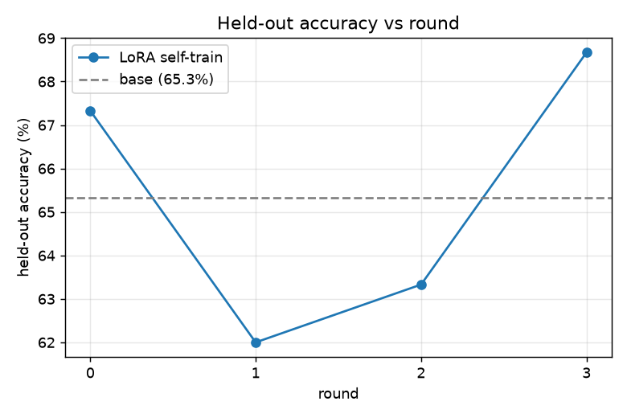
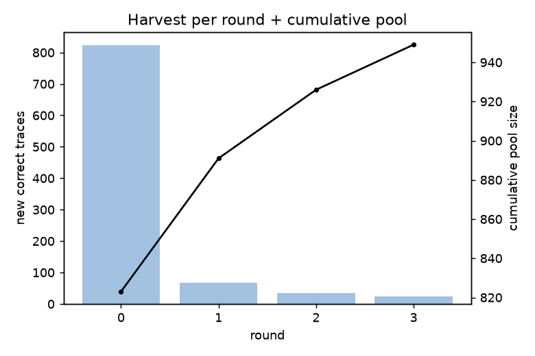
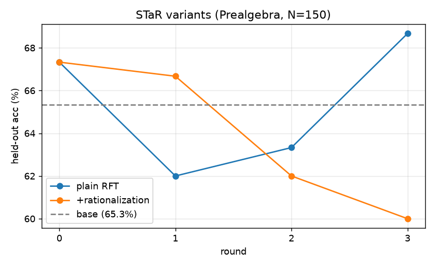
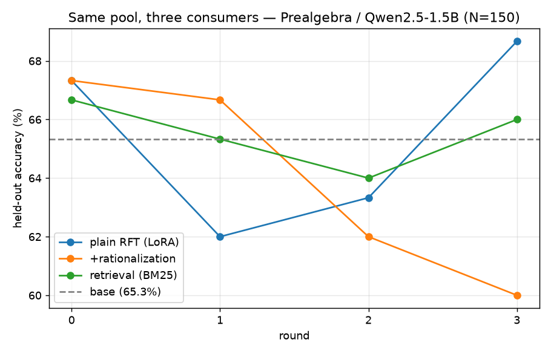

# ai-engineer-hackathon — Project Wiki

Living notebook for this repo: what we built, what we found, why we chose what we
chose. Newest sections at the bottom of each part. Last updated 2026-06-27.

---

## 1. What this is

Hackathon submission repo. Working thesis: explore **small (1B-class) open-weight
models on MATH**, and test whether cheap **activation steering vectors** can act as
a "skill primitive" — a way to add capability at inference without training in the
loop. If that works, the project leans on activation vectors; if not, LoRAs stay the
workhorse and activations are diagnostic-only.

Repo: https://github.com/otceliker/ai-engineer-hackathon (public).

---

## 2. Infrastructure

Two hosts, kept in sync via the same scripts + a committed `requirements*.txt`.

| | Mac (laptop) | neptune (server) |
|---|---|---|
| Role | interp/dev, mirror | GPU eval + experiments |
| Reach | local | Tailscale `100.64.113.61` (LAN `192.168.70.99` when home) |
| Compute | Apple Silicon, MPS | RTX 3090, 24 GB VRAM |
| Python env | `uv` venv `.venv` | `uv` venv `.venv` |

Notes / gotchas:
- During the hackathon the Mac was on venue wifi (`10.84.x`), **off** the home LAN,
  so neptune is only reachable over **Tailscale** (`100.64.113.61`). `sshn`/LAN IP
  time out from there.
- `uv` was not on the Mac initially — installed via the official script to
  `~/.local/bin/uv`. Already present on neptune at `/home/orhan/.local/bin/uv`.
- HF token lives in the Mac's `~/.zshrc` as `HF_TOKEN` (needed for the gated Llama).
  It was piped to neptune's `~/.cache/huggingface/token` (0600), never echoed.
- **neptune's `llm-server.service` (qwen3.6-27b) was STOPPED** to free the GPU for
  the hackathon (`sudo systemctl stop llm-server.service` → VRAM 23.6 GB → 1 MiB).
  It was `stop`ped, not `disable`d, so a reboot would bring it back.
  **To restore at the end:** `sudo systemctl start llm-server.service`.

---

## 3. Models & data on disk

All safetensors, under `models/` (gitignored). Downloaded with `scripts/download.py`
(idempotent, resumable, exponential backoff). Both hosts have the first three;
**neptune additionally** has the two general Qwens.

| Key | Repo | Size | Type | Hosts |
|---|---|---|---|---|
| deepseek | deepseek-ai/DeepSeek-R1-Distill-Qwen-1.5B | 3.4G | reasoning | Mac + neptune |
| qwen | Qwen/Qwen2.5-Math-1.5B-Instruct | 2.9G | math-specialized | Mac + neptune |
| llama | meta-llama/Llama-3.2-1B-Instruct (gated) | 2.4G | general | Mac + neptune |
| qwen25-general | Qwen/Qwen2.5-1.5B-Instruct | 2.9G | general | neptune |
| qwen3 | Qwen/Qwen3-1.7B | 3.8G | general + thinking | neptune |

Dataset: **Hendrycks MATH** via `nlile/hendrycks-MATH-benchmark` (clean 12,000 train /
500 test split) under `data/` (gitignored). Columns: `problem, solution, answer,
subject, level, unique_id`. Graded with **`math-verify`** (HF) on the `\boxed{}`
answer — never hand-rolled.

---

## 4. MATH benchmark results (full 500-problem test set)

Run via `run_full_eval.sh` (vLLM + math-verify). See `RESULTS.md` for the canonical
copy; per-example JSONL in `results/` (gitignored).

| Model | Accuracy | Time | Notes |
|---|---|---|---|
| **Qwen3-1.7B (thinking)** | **69.0%** (345/500) | 1578s | newest, top scorer, long CoT |
| DeepSeek-R1-Distill-Qwen-1.5B | 64.8% (324/500) | 498s | reasoning distill |
| Qwen2.5-Math-1.5B-Instruct | 60.0% (300/500) | 62s | math-specialized |
| Qwen2.5-1.5B-Instruct (general) | 45.4% (227/500) | 64s | general baseline |
| Llama-3.2-1B-Instruct | 24.8% (124/500) | 38s | general, weak at math |

Takeaways:
- **Math specialization buys ~+14.6 pts** at fixed size/recipe: Qwen2.5-Math (60.0%)
  vs Qwen2.5 general (45.4%). The cleanest controlled comparison we have.
- **Reasoning/thinking helps more than specialization**: Qwen3-1.7B thinking (69.0%)
  and DeepSeek distill (64.8%) top the math-tuned non-reasoning model — at a large
  latency cost (Qwen3 ~25× slower than Qwen-Math).
- DeepSeek's 64.8% is below its published ~83% pass@1 — the 8192-token cap truncates
  some long traces and it's a single low-temp sample. Tunable, not chased.
- Per-subject (Qwen2.5-1.5B general, used to pick the steering category):
  Precalc 12.5% · Inter-Algebra 27.8% · Geometry 39.0% · **Counting&Prob 42.1%** ·
  **Prealgebra 52.4%** · Algebra 61.3% · Number Theory 67.7%.

---

## 5. Tooling

- `scripts/download.py` — fetch any of the 5 models + the MATH dataset. `--all`
  includes the gated Llama; `--only <key>` for one. Keeps safetensors, skips
  duplicate `.bin/.pth/.gguf`.
- `scripts/eval_math.py` — quick MATH eval via **vLLM + math-verify**. Reports
  accuracy overall / by level / by subject, writes per-example JSONL.
- `run_full_eval.sh` — runs all models with per-model gen settings.
- `scripts/steer_math.py` — the steering-vector capability gate (Part 7).
- `requirements.txt` (download/grading) + `requirements-eval.txt` (vLLM/ninja).

### vLLM gotchas on a fresh box (neptune)
Learned the hard way; baked into the scripts/`requirements-eval.txt`:
1. vLLM shells out to **`ninja`** — must be pip-installed **and** `<venv>/bin` on
   `PATH` at runtime (non-interactive SSH doesn't have it).
2. **flashinfer**'s JIT sampler kernels fail to compile here → uninstall
   `flashinfer-python` and run with `VLLM_USE_FLASHINFER_SAMPLER=0` (native sampling).
3. Default to **`enforce_eager`** (skip `torch.compile`) for reliable startup.
4. Stack: torch 2.11.0+cu130, transformers 5.12.1, vllm 0.23.0.

---

## 6. Key decisions (log)

- **Format = safetensors, not GGUF.** GGUF/llama.cpp is a closed inference engine
  with no clean per-layer hidden-state hooks; activation/steering work needs
  PyTorch + transformers. (Drove the whole download format choice.)
- **Eval engine = vLLM** for the 500-problem runs (batched, fast); **transformers +
  forward hooks** for the steering work (vLLM can't expose the residual stream).
- **Steering model = Qwen2.5-1.5B-Instruct** (non-reasoning): mean-pooling a vector
  over hundreds of CoT tokens would dilute it to mush, so reasoning models are wrong
  for this test. Category **Prealgebra** (52.4%, closest to the 40–60% Goldilocks
  band, plenty of train-split problems).
- **Build/eval steering on the MATH *train* split**, never the 500-item test set —
  otherwise the benchmark we report gets contaminated.
- Committed tooling only; weights, datasets, and `results/` are gitignored.

---

## 7. Steering-vector capability gate

**One question (a GATE, not a feature):** can a single difference-of-means activation
vector, added to the residual stream at inference, raise MATH accuracy on a skill
category? YES → activation vectors become the cheap skill primitive. NO → they're
diagnostic-only and LoRAs stay the workhorse. **A flat result is a valid, useful
answer** — it kills the path fast, which is the point. Time-boxed ~45 min.

### Design (after a review cycle)
Built `scripts/steer_math.py`: label train attempts correct/incorrect (greedy +
math-verify), build `v = mean(act|correct) − mean(act|incorrect)` mean-pooled over
generated tokens at mid-stack layers, normalize, add `alpha · mean_resid_norm · v̂`
to the residual during generation, sweep, measure held-out accuracy.

A critique → designer-ruling cycle hardened it. Items folded in:
- **#1 Paired McNemar, not a +5pp/N=60 threshold.** At N=60 the SE of a proportion
  difference is ~9pp, so +5pp sits inside the noise. Baseline & steered run on the
  *same* held-out items → analyze the **flip matrix** (fail→pass vs pass→fail) with
  exact McNemar. "Cold-fail recovery" *is* the fail→pass cell. WIN bar raised to
  **+10pp AND p<0.05**.
- **#2 Shuffled-label control** is the real null (the random unit vector is the weak
  one). `mean(correct)−mean(incorrect)` can encode "easy problem / be fluent", not
  skill, because correct problems are systematically easier. Permuting the
  correct/incorrect labels and rebuilding keeps the data distribution and destroys
  only the label correlation. Kept the random-vector control as secondary.
- **#4 Hook gated to decode steps only** (`hs.shape[1]==1`) so it steers generation,
  not the prompt during prefill.
- **#5 Alpha grid extended downward** `{-1,-0.5,0,0.1,0.25,0.5,0.75,1,2}` — a real
  effect, if any, shows at small α before coherence collapse.
- **#7 `\boxed{}` emission rate** logged separately, so a format break can't
  masquerade as a capability drop.
- **Winner's-curse hedge:** picking the best of 27 configs then testing the null only
  there is lenient. Each null (5 shuffled + 5 random) runs its **own** positive-alpha
  sweep at the best layer; WIN must beat the **null max**.
- Held the line on **not over-engineering the gate**: single coarse pass, no
  N=150–200 confirmation unless a candidate appears. FLAT framed as *power-limited*
  ("no effect detectable at N=60"), not "no effect exists". One permitted follow-up
  if dead flat: try one earlier layer (~30% depth), then stop.

### Bug caught by the smoke test (worth remembering)
In **transformers 5.x the Qwen decoder layer returns a bare tensor, not a tuple**, so
`out[0]` indexed the batch dim and the inject hook was a **silent no-op** (every α gave
identical output). Fixed to handle tensor-or-tuple + a guard that warns if injection
never fires. Smoke test then showed the expected dose-response (α=0 == baseline; α<0
and large α degrade). *Always smoke-test a steering hook by checking that a large α
actually breaks generation.*

### Result (Prealgebra, Qwen2.5-1.5B, baseline held-out 56.7%, N=60)
The grid is unambiguous: **no positive α at any of layers 12/16/19 beats baseline.**
The vector only ever does nothing or hurts, monotonically.

| layer | α=0.1 | 0.25 | 0.5 | 0.75 | 1 | 2 |
|---|---|---|---|---|---|---|
| 12 | −6.7 | −28.3 | −55.0 | −55.0 | −53.3 | −56.7 |
| 16 | **+0.0** | −28.3 | −55.0 | −53.3 | −53.3 | −56.7 |
| 19 | −5.0 | −16.7 | −48.3 | −55.0 | −56.7 | −56.7 |

(Δpp vs baseline. α=0 reproduces 56.7% exactly at all layers — hook sanity ✓.
α<0 destroys accuracy; large α collapses coherence.)

Best positive config: **layer 16, α=0.1 → 56.7% = +0.0pp** (5 fail→pass vs 5
pass→fail, McNemar p=1.00). Net zero.

**Controls (winner's-curse-matched, each null's best Δ over the α-sweep at layer 16):**
- shuffled-label: −8.3, −1.7, −6.7, +0.0, −1.7 → **null max +0.0pp**
- random unit:    −6.7, +0.0, −8.3, −6.7, −5.0 → **null max +0.0pp**

The real vector's best (+0.0pp) does **not** beat the null max (+0.0pp) — they tie at
zero, and *no* config (real or null) ever produced a positive Δ. The direction is
indistinguishable from noise.

### Verdict: **DEGRADE** (printed; FLAT/DEGRADE boundary — best real Δ ≤ 0 everywhere)
Best real Δ is 0.0pp — it cannot clear the +10pp WIN bar regardless of controls.
Pushing along the difference-of-means direction never recovers a single net problem;
the only safe point is α≈0. The direction is **entangled with general capability**,
not a clean math-skill primitive.

**Recommendation:** steering can't carry capability here on this model/category.
**Keep LoRAs as the workhorse; use activation vectors as diagnostic/visual only.**
Caveat that matters even for a hypothetical WIN: a positive result could still reflect
a "be-more-careful/easy-problem" axis rather than a skill primitive — the
shuffled-label control is what would have licensed any causal read.

---

## 7b. Direction 2 (proposed, not yet built): grader-driven LoRA self-improvement loop

The pivot after steering came back FLAT: if LoRA is the workhorse, can it *bootstrap*?
Closed loop on one category — model attempts problems, grader keeps correct traces,
train a LoRA on them, held-out accuracy climbs over 3–5 rounds. Essentially STaR /
rejection-sampling fine-tuning (RFT/ReST).

Locked design (from the brief): generate with latest adapter, **train from base** on
the cumulative pool every round; sample (T≈0.8, K≈4–8) to harvest, greedy to eval;
fixed held-out, disjoint IDs, no leakage; **frontier expansion** (held-out problems
solved in later rounds that round-0 couldn't) is the headline metric — it's what makes
it self-improvement vs. resampling. vLLM for generate+eval (the bottleneck), PEFT for
training. Reference: Qwen2.5-1.5B-Instruct, Prealgebra, train pool from MATH train /
held-out from MATH test. Expect +3–8pp total with diminishing returns (no hockey stick).

**Assessment (CC review) — ranked risks + suggested changes:**
1. **Frontier expansion is the make-or-break and is fragile at 1.5B.** Problems the
   base fails 0/K are hard; a LoRA on easy traces rarely cracks them → risk of ~0
   frontier expansion = RFT sharpening, not bootstrapping. **Add STaR rationalization**
   (hint the gold answer on failed *train* problems, generate rationale backward,
   verify, add to pool — leakage-free, attacks the exact metric). Higher-leverage than
   the parked self-curriculum extension. Also log *train-side* new-problems-solved
   (leading indicator).
2. **False-positive traces (right answer, wrong reasoning).** Math-Verify checks final
   answer only; short Prealgebra answers invite lucky hits that teach bad reasoning.
   Guard: require real `\boxed{}`, drop ultra-short answer-only traces.
3. **N≈82 power trap (same lesson as the steering test).** +3–8pp sits inside the
   ~5.5pp SE at N=82 → curve may be noise. Lean on the round-N-vs-round-0 flip matrix /
   **McNemar** (already logged); consider enlarging frozen held-out to 150–200 (disjoint
   IDs is the real leakage constraint, not "must be test split").
4. **vLLM-LoRA path unproven on this box** (cf. our flashinfer/ninja/enforce_eager
   fights). Smoke-test round-0 train→PEFT-save→vLLM-load(LoRARequest)→generate before
   trusting the loop; prefer teardown/rebuild over hot-swap.
5. Cheap specifics: train on `(problem→trace)` with few-shot scaffold stripped → eval
   zero-shot, box-rate becomes a real signal; fix a ~400-problem train pool for loop
   rounds, scale only for the final headline.

Status: **GREEN-LIT, building.** Designer accepted the full review; sequencing locked:
plain loop first, frontier instrumented from round 0, rationalization as an explicit
A/B only after. All five review items folded into the build.

**De-risk #4 PASSED (2026-06-27):** vLLM-LoRA round-trip verified on this box.
PEFT-train (peft 0.19.1) → save adapter → vLLM 0.23 load via `LoRARequest`
(`enable_lora=True, max_lora_rank=16, enforce_eager=True, VLLM_USE_FLASHINFER_SAMPLER=0`)
→ generate. A toy adapter trained for 6 steps visibly changed behavior (base rambled
without a box; adapter emitted `\boxed{15}`). No errors. → use `LoRARequest` for
generation; teardown/rebuild vLLM between gen and train (both need the full 24 GB).
Trainer: `scripts/lora_train.py` (manual loop, no HF Trainer; LoRA from base, rank 16).

**Loop CLOSES end-to-end (2026-06-27).** `scripts/star_loop.py` (orchestrator) +
`scripts/star_gen.py` (vLLM gen worker) + `scripts/lora_train.py` (PEFT). Smoke
(pool=20, held=20, 2 rounds, K=4): base 70% → r0 80% → r1 80%; r1 harvested only 3 new
traces with **train-new=0** — the predicted plateau on a fixed pool, visible even at
toy scale, and the instrumentation caught it. Headline run launched: pool=400,
held=150, 4 rounds, K=6, 2 epochs.

**Two infra gotchas that cost real time (both fixed in `star_loop.py`):**
1. **vLLM EngineCore orphans the GPU.** It's a `multiprocessing` spawn child in its
   OWN session — not findable by name, and `killpg` of the gen subprocess misses it.
   It keeps the full ~22 GB after the parent exits → the next step (training) OOMs.
   Fix: after each gen, `kill_gpu_procs()` kills whatever PID still holds GPU memory
   (safe because llm-server is stopped → nothing else legitimately uses the GPU), then
   `ensure_gpu_free()` polls `nvidia-smi` until VRAM actually drops.
2. **Trainer OOM in cross-entropy over Qwen's 152k vocab.** Real traces are ~600–800
   tokens; at batch 8 with no gradient checkpointing the `(B,S,152064)` logits + CE
   upcast blow past 24 GB. Fix: `gradient_checkpointing_enable()` + `use_cache=False`
   + default batch 4. (Toy smoke missed it — 20-token sequences were too short to OOM.)

### Result — run 1 (Prealgebra, Qwen2.5-1.5B, held-out N=150, K=6, 4 rounds, 2 epochs)

| | base | r0 | r1 | r2 | r3 |
|---|---|---|---|---|---|
| held-out acc | 65.3% | 67.3% | 62.0% | 63.3% | 68.7% |
| Δ vs base (pp) | — | +2.0 | −3.3 | −2.0 | +3.3 |
| McNemar p vs base | — | 0.66 | 0.30 | 0.61 | 0.27 |
| fail→pass / pass→fail | — | 12/9 | 5/10 | 6/9 | 9/4 |
| train-new solved | — | 298 | 13 | 8 | 5 |
| harvested / cum pool | — | 823/823 | 68/891 | 35/926 | 23/949 |
| box rate | 0.80 | 0.87 | 0.87 | 0.89 | 0.89 |




**Verdict: FLAT / within-noise — NOT a real climb.**
- **No significant improvement at any round** (every McNemar p ≥ 0.27). The curve wiggles
  around the 65.3% baseline (67→62→63→69) and dips *below* base in rounds 1–2. The
  round-3 +3.3pp is 9 fail→pass vs 4 pass→fail — noise at N=150.
- **Train-side frontier collapses after round 0: 298 → 13 → 8 → 5.** Round 0 harvests
  823 traces from 400 problems; later "improved" adapters crack almost no *new* problems.
  This is **sharpening, not bootstrapping** — the exact failure mode we instrumented for.
- fail→pass / pass→fail churn is ~balanced → trading problems, not netting gains (noise +
  mild self-generated-style overfitting; round 1's dip lost 10 previously-solved problems).
- box rate ~0.87–0.89 (zero-shot, no few-shot scaffold) — stable, so format isn't driving
  the round-to-round moves, but ~12% non-emission caps measurable accuracy.

**Observations:**
- Base came in at **65.3%** on the 150-problem train-split held-out (greedy, zero-shot +
  instruction) — higher than the 52.4% test-split figure, so *less headroom* than hoped.
- **Training dominated wall-clock, not generation** (train ~290–350s vs gen ~130–170s/round)
  — opposite of the brief's expectation, because train = 2 epochs over a growing ~900-trace
  pool with gradient checkpointing. Generation would dominate again at larger K / pool.

**Implication:** plain RFT self-training on a *fixed* pool plateaus at this scale. This is
the empirical motivation for (a) **rationalization** (manufacture traces for unsolved
problems → actually expand the frontier) and (b) the **baseline arms** (does even this much
movement beat using the same pool in-context?). Both already scoped; this result green-lights
pursuing them rather than scaling the plain loop.

### Rationalization (STaR's missing half) — A/B running
Decision: **both, rationalization first.** Implemented as `--rationalize` in `star_loop.py`:
for train problems still unsolved after the normal harvest, hint the gold answer
(`build_rat_prompt`), sample `kr` solutions, keep only those that (a) Math-Verify against
gold, (b) pass the false-positive guard, (c) don't leak "we're told the answer"
(`LEAK_PHRASES`). Train on the **bare problem → trace** (hint stripped). New metrics:
`n_rationalized`, `rat_new_solved`. Smoke OK (cracked a problem sampling missed). Full A/B
launched: identical splits/seed to run 1, `--rationalize --kr 4`.

**Result — rationalization BACKFIRED (significant).** Same base (65.3%), same splits.

| round | base | r0 | r1 | r2 | r3 |
|---|---|---|---|---|---|
| plain RFT | 65.3 | 67.3 | 62.0 | 63.3 | **68.7** |
| + rationalization | 65.3 | 67.3 | 66.7 | 62.0 | **60.0** |



- **Final-round paired head-to-head: plain 103/150 vs rat 90/150 — 13 plain-better, 0 rat-better,
  McNemar p < 0.001.** Rationalization is significantly worse. vs base it ends at p=0.057 (near-sig
  *degradation*: 3 fail→pass / 11 pass→fail).
- **It expanded the frontier as designed** — manufactured gold-verified traces for 36 problems
  (rat_new 22→10→1→3) sampling couldn't crack — **and still hurt.** The held-out curve declines
  monotonically as more rationalized traces enter the pool.
- **Lesson: frontier expansion is necessary-but-not-sufficient; trace *quality* dominates.**
  Reasoning *backward from a given answer* is post-hoc confabulation — reaches the gold number
  without a derivation the model could honestly produce — so training on it teaches the 1.5B to
  confabulate and poisons the pool. At this scale the bottleneck was never trace *coverage* for
  hard problems; it's that hinted traces are bad data. (Rationalization was CC's top recommendation;
  the A/B refuted it for this setting — which is why we A/B'd rather than assumed.)

**Combined STaR verdict:** at 1.5B / Prealgebra, neither plain RFT (flat, within noise) nor
rationalization (significant degradation) bootstraps capability from self-generated data on a
fixed pool. Next: the **baseline arms** — does using the same pool *in-context* (retrieval /
prompt-opt) do any better than weight updates that went flat-to-negative?

### Arm A — retrieval (BM25) result + three-way verdict
`scripts/arm_retrieval.py`: same pool (the LoRA run's per-round `correct_pool.jsonl`) and same
held-out (from manifest); for each held-out problem, BM25-retrieve top-3 solved (problem, trace)
pairs as worked examples, generate greedy, grade. Zero-dependency BM25 (no embedder risk).
Logs BM25 similarity per problem (near-duplicate instrumentation). Retrieval curve:
66.7 → 65.3 → 64.0 → 66.0 — **flat**, hovering at base.

**Final-round paired McNemar (same 150 held-out):**

| comparison | scores | flips | p |
|---|---|---|---|
| LoRA vs retrieval | 103 vs 99 | 11/7 | **0.48 (tied)** |
| LoRA vs rationalization | 103 vs 90 | 13/0 | <0.001 |
| retrieval vs rationalization | 99 vs 90 | 13/4 | 0.049 |



**Headline: LoRA self-training is statistically TIED with BM25 retrieval of the same traces** —
weight updates bought nothing over using the pool in-context. (Retrieval didn't win, so the
near-duplicate caveat is moot.) Arm B (prompt-opt) scoped as optional; the picture is already
robust, so deprioritized. `scripts/star_compare.py` / `scripts/final_summary.py` produce the
overlays + pairwise tests.

---

## Project-wide verdict (so far)

At **1.5B on MATH / Prealgebra**, every cheap "self-improvement primitive" we tested is
flat-to-negative on a held-out set, instrumented with paired McNemar to avoid fooling ourselves:

| approach | result |
|---|---|
| Activation steering (diff-of-means) | FLAT / DEGRADE — indistinguishable from noise + matched controls |
| LoRA self-training (RFT) | FLAT — within noise of the 65.3% base |
| Rationalization (STaR backward) | **DEGRADE** — significant; confabulated traces poison the pool |
| Retrieval (BM25, in-context) | FLAT — **tied with LoRA** → weight updates unnecessary |

Two actionable findings: (1) **rationalization actively hurts** at this scale; (2) whatever
marginal value the self-generated pool holds is **fully captured in-context** — no training
needed. A clean, well-instrumented negative result. Honest > hockey-stick.

## 8. Open items / next steps

- [ ] Restore neptune `llm-server.service` at hackathon end (`sudo systemctl start`).
- [ ] Mac: only base + grading deps installed; add torch/transformers/nnsight there
      when starting interp work (MPS).
- [ ] Steering single permitted follow-up *only if* we revisit: one earlier layer
      (~depth 8) — otherwise the gate has answered.
- [ ] Not evaluated for steering: other categories/models (out of scope per stop rule).

## 9. Reproduce

```bash
# download (per host)
uv venv .venv && uv pip install --python .venv/bin/python -r requirements.txt
.venv/bin/python scripts/download.py --all          # needs HF_TOKEN for llama

# MATH eval (GPU host)
uv pip install --python .venv/bin/python -r requirements-eval.txt
VLLM_USE_FLASHINFER_SAMPLER=0 PATH="$PWD/.venv/bin:$PATH" bash run_full_eval.sh

# steering gate (GPU host, transformers + hooks)
VLLM_USE_FLASHINFER_SAMPLER=0 PATH="$PWD/.venv/bin:$PATH" \
  .venv/bin/python scripts/steer_math.py --model models/Qwen__Qwen2.5-1.5B-Instruct
```
